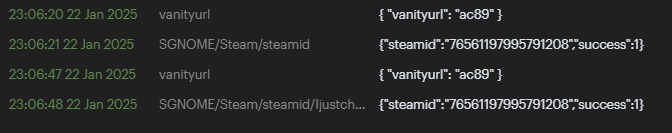

# Dev Diary

## 1/20/2025
I read a lot about newer frameworks and tools in javascript and am looking at Fastify and Svelte.

I enjoy working with Fastify so far. I tried setting up a backend that calls the steam API. In the process, I realized a simple proxy built with @fastify/http-proxy would be a lot less work. I will work on this tomorrow

## 1/21/2025
I got my proxy set up with fastify and used the Opera LLM, whatever that is, to work through a few issues. It was my first time using an LLM to help code and it went pretty well. The code it generated was accurate. I tried to implement the proxy myself and identified the core problem then shared my code with the LLM and asked how to solve that.

I also dockerized the proxy and set up a very basic configuration management repo. It's pretty sketchy right now.

I want to start building something out with Svelte and will see if I can take an MFE approach with Svelte frontends and Fastify backends. I want to be able to build new features easily without revisiting code that works, so I'll be avoiding HTTP and using a broker. I want the system to be extensible. I will probably use Redis with pub/sub instead of MQTT since Redis can be the broker and also serve as service-level storage.

Tomorrow I will add Redis to the configuration and create a Fastify service that uses the redis plugin. It will be a gateway service that calls the Steam API via the proxy and dumps data to the Redis broker. I'll then start building an MFE off of this.

## 1/22/2025
### Redis vs RedisStack
Redis is the basic in-memory store

Redis-Stack includes additional tools for babies like a query engine and stronger typing

I did a quick end to end test with the @fastify/redis plugin. I created a backend that fetches data via the proxy and dumps it to the Redis bus. I'll start planning out the SteamGateway tonight and implementing that based on this work.

I got something working and it's pretty great. I decided not to use @fastify/redis because it didn't seem necessary for my usecase. I will have multiple clients with distinct purposes so using ioredis ended up being a lot simpler, and it's a much more actively maintained package anyway.

I've also added js-yaml to the setup to see if I can configure topics with a yaml file. I really like yaml for this type of thing, more than JSON.

To set up configurable topics, I defined a yml file like so:
```yml
resolveVanityUrl:
    sub:
      - vanityurl
      - test2
    pub:
      - SGNOME/Steam/steamid
getOwnedGames:
    sub:
      - SNGOME/Steam/steamid
    pub:
      - SGNOME/Steam/OwnedGames
```

I also updated my package.json `build:ts` command to copy the config directory on build:
```
"build:ts": "tsc && cp ./config ./dist -r",
```
Then I read in this yaml file and parse it to JSON using `js-yaml`. Each service peels off its config and subscribes to the topics. There's a simple interface backing this structure.
```ts
export default fp(async function (fastify: FastifyInstance) {
    const SERVICE_NAME = "Service::resolveVanityUrl";
    let resolveVanityUrlTopicMap: ITopicMapping = { sub: ['vanityurl'], pub: ['steamid'] } as ITopicMapping;
    try {
        const { resolveVanityUrl }: any = await yaml.load(fs.readFileSync('./config/topic-map.yml', 'utf8'));
        console.log(`${SERVICE_NAME} loaded topic map from yml`);
        resolveVanityUrlTopicMap = resolveVanityUrl;
    } catch (e) {
        console.log(e);
    }
    console.log(`${SERVICE_NAME} Topics:
        Sub: ${resolveVanityUrlTopicMap.sub},
        Pub: ${resolveVanityUrlTopicMap.pub}`)
...
    // Subscribe to the topics
    await consumer.subscribe(...resolveVanityUrlTopicMap.sub, async (err, count) => {
        console.log(`Consumer subscribed to ${count} channels`);
    });
```

Now I can configure the channels that my service is publishing and subscribing to:

All I did was modify the yml file and save, after hot reload the service is publishing to a different topic. Very cool.

So far I am cautiously optimistic about this approach versus the Nexus style we use at work. Having a single block of code that handles some distinct business logic keeps things clean. I will have to see how this fares against more complicated microservices. I also need to figure out the websocket aspect.

I will continue building out the gateway and get more Steam data onto the Redis broker.

`...15 minutes later`

I'm back and I've got a new microservice. I would rate it "ez-pz". This service responds to the steamid message with the data from a GetOwnedGames call and publishes that to the bus. This is awesome. I also further generalized the code a bit.

Before I get ahead of myself, I'll make a few things configurable like the redis connection.

## 1/23/2025 Part 2
I got things in a good state on the docker side.

I am looking in to websockets and seeing some interesting things out there. There's a SaaS out there called Pusher, which is a complete ripoff, as all SaaS is, but the idea is interesting. Hosting a dedicated websocket server that can scale to specifically address a potential bottleneck with websockets is convincing. The architecture I'm used to involves a BFF where the backend hosts a websocket server for its frontend, which means:
- N number of MFEs, N number of websocket connections
- The backend cannot scale independently of the websocket functionality, they are coupled. I don't know what a reasonable number of websocket connections is for a single server to handle, but the number seems surprisingly low. You might end up deploying 10 copies of an HTTP API just to get 10 copies of your websocket server running.
- Separation of Concerns issue as a backend service needs to reconcile data processing with managing websocket connections.

I am specifically looking at http://docs.socketi.app which is a self-hosted websocket server that's fully compatible with "Pusher Apps" (they use the same client code) and can be connected to Redis.

I would then look at my backend services as solely responsible for things like data processing, aggregation, authentication, and/or HTTP APIs.


The interesting thing here is the backend and frontend services are not really coupled at all. If a backend hosted an HTTP API for it's frontend, and it was designed specifically to mee the needs of that frontend, then sure. They no longer have the websocket in commmon, they now have distinct concerns. The backend, at least the style of backend we typically produce, would be an independent service that basically lives in the redis world, transforming data, fetching data, aggregating data. It's not responsible for sending those results to any particular client, it just lives in redis world. The frontend becomes a self-sufficient client with its own authenticated and secure connection to a websocket server that will asynchronously provide it with the data that that frontend needs, but it isn't sure where it came from.

It makes me a little nervous to deviate this way from what we call BFF but it's very interesting and I can see the benefits.

This idea is also clearing up some confusion I've had about how to structure the MFEs. My initial thought was to somehow smash Fastify and Svelte into one report and take the same approach that we do at work. A service folder and a web app folder that are collocated and built together. Problem is there's SvelteKit which seems convenient, but a little redundant, but also provides some functionality that fastify wouldn't and shouldn't   Routing of the frontend as an example, Fastify has nothing to do with that but Svelte doesn't solve it without SvelteKit or another routing dependency. I am trying to use as few tools as possible.

I have seen some examples of SvelteKit and Fastify working together, it's definitely doable, but I think I'd just make a huge mess instead of establishing a repeatable pattern.

Some Pros and Cons of this new approach

Cons:
- I doubt Socketi is on Ironbank ( I just checked, it's not)
- No backend-guarantee if frontends are not deployed with their backend.
- A fairly significant deviation from the current approach.
- No guaranteed frontend with a backend. Ironic because having a frontend with every backend is a common complaint, but it does promote status style UIs that could be useful for things like admin dashboards.


Pros:
- Should be better for MFEs, easier to package up a frontend to be served via module federation with softer dependencies.
- Simple to implement alternative, additional, or conditional providers for frontend data by swapping out the backend producer of that data.
- Better Separation of Concerns, fewer moving parts. Business logic is not munged with frontend state management concerns.
- Component Library Monorepo is more viable. I could not figure out how to do this with collocated BFFs

Something built with Socketi and Svelte: https://github.com/syntaxlexx/sveltekit-soketi-fastify-prisma-demo/blob/main/backend/server.js

Socketi documentation https://docs.soketi.app

# Core Tools Used
## Infrastructure
I'm calling it the NERDS stack
- Node
- (E)NGINX
- Redis
- Docker
- Svelte

## Service Libraries
- Fastify: An express-like javascript backend with a large community. It's fast. It has a nice module plugin and routing system and there's really not much to learn.
- dotenv: For configuring environment variables
- ioredis: I am using Redis as the broker and database. Ioredis is the official javascript node client.
- js-yaml: For reading yaml files. I'm using yaml as a more human-readable way to configure services.

# Service Setup

## Initial Setup
Create a new repo and run these commands:
```
fastify generate . --lang=ts --esm
npm install
npm i -D dotenv
npm i -D ioredis
npm i -D js-yaml
npm i -D @types/js-yaml
```
Copy in the base redis plugin


# Fastify

## Installation
install fastify-cli with npm

`npm install fastify-cli --global`

## Generating a new project
`fastify generate . --lang=ts --esm`

This generates a new fastify project configured for Typescript and ESM module imports (import Thing from 'path')

## Routes
Similar to Express but a bit more readable
Structure of routes is based on the file system

## Creating a plugin
Is easy

# Svelte and SvelteKit

## Installation
None wtf?

## Generating a new project
`npx sv create .`
Use Typescript and add any additional tooling

Install shadcn-svelte `npx shadcn-svelte@latest init`
- Style: New York
- base color: slate
- rest are default

## Adding a component

- tailwind.config.css
- $lib/components/ui
- $lib/components/ui/util.ts

# SSE vs. Websockets
Server Side Events are an exciting opportunity when contrasted with websockets. Websockets can be complicated to implement, especially on the server side. There are also scalability concerns with websockets as a single websocket server can't host an infinite number of connections. When a message needs to be sent, the server is going to loop through every connected client and there's not much you can do about that. SSE has the same limitation in that the server must loop through every connected client to push data. At some point our services are going to run out of juice and will need to be scaled by creating additional instances of the service. Since it's a BFF, it's a bit wasteful. We are only scaling for the sake of the websocket/SSE but need to scale everything else. Refer to my ramblings on a Websocket Server

SSE seems much easier to reason about but it has one major drawback that Websockets don't. Apparently browsers only support ~6 conccurent connections. SSE counts as a concurrent connection, but websockets dont. This constraint is important because in a microfrontend architecture where each MFE is establishing 1 or more SSEs, and those microfrontends are composed into an app, you'll hit the limit real quick. There are workarounds for this but more research has to be done.

is it true that browsers cannot support more than six concurrent connections for SSE?
Yes, that's correct! Browsers do impose limits on the number of concurrent connections for Server-Sent Events (SSE). Here’s a breakdown of the key points regarding these limitations:

Connection Limits:

Most browsers allow a maximum of 6 concurrent SSE connections per domain. This means that if you have multiple tabs open to the same domain, the total number of SSE connections across those tabs cannot exceed this limit.
Browser Variations:

Different browsers may have slightly different limits:
Chrome typically allows 4-5 concurrent connections.
Firefox also tends to limit connections to around 4-5.
Opera does not have the same strict limitations as some other browsers.
Per Domain Basis:

The limit is enforced on a per domain basis. So, if you are connected to www.example.com, you can have up to 6 SSE connections from that domain, regardless of how many tabs you have open.
Practical Implications:

If you exceed the limit, additional connections may fail to establish, which can impact applications relying on real-time data updates.
Understanding these limitations is crucial for developers working with real-time web applications. If you have more questions about SSE or any other topic, feel free to ask! 😊

----

Is it correct to say this could cause problems in a composable microfrontend architecture where each microfrontend would want to implement SSE to its respective backend?

----

Absolutely! Using Server-Sent Events (SSE) in a composable microfrontend architecture can indeed lead to challenges due to the concurrent connection limits imposed by browsers. Here’s a detailed breakdown of why this can be problematic:

Challenges with SSE in Microfrontend Architectures
Connection Limits:

As previously mentioned, browsers typically allow only about 6 concurrent SSE connections per domain. In a microfrontend architecture, if each microfrontend tries to establish its own SSE connection to its backend, you could quickly hit this limit.
Resource Contention:

If multiple microfrontends are competing for the same connections, some may fail to receive real-time updates, causing inconsistencies in the user experience.
Scalability Issues:

As the number of microfrontends grows, the risk of exceeding connection limits increases, making it difficult to scale the application effectively without running into browser-imposed restrictions.
Increased Complexity:

Managing multiple SSE connections can add complexity to the application. Developers would need to implement logic to handle connection failures and retries, as well as coordinate state management across different microfrontends.
Potential Workarounds:

To mitigate these issues, consider the following alternatives:
Centralized SSE Connection: Have a single SSE connection that all microfrontends subscribe to, allowing them to share updates without exceeding connection limits.
WebSockets: Use WebSockets, which allow for full-duplex communication and generally do not have the same connection limits as SSE.
Polling: Implement a polling mechanism as a fallback for microfrontends that cannot establish an SSE connection.
Summary
While SSE can be a powerful tool for real-time data updates, its limitations in a microfrontend architecture can create significant challenges. It's essential to design your architecture with these constraints in mind to ensure a smooth and responsive user experience.

If you have more questions or want to explore this topic further, feel free to ask! 😊

----

is there any sensible way around this limitation?

----

Yes, there are several sensible strategies to work around the limitations of Server-Sent Events (SSE) in a microfrontend architecture. Here’s a list of effective approaches:

Strategies to Overcome SSE Limitations
Centralized SSE Connection:

Single Connection: Establish a single SSE connection at a central point (e.g., a shared service or shell application) and broadcast updates to all microfrontends.
Event Bus: Use an event bus or a shared state management system (like Redux or EventEmitter) to distribute data from the single SSE connection to the respective microfrontends.
WebSockets:

Bidirectional Communication: Consider using WebSockets, which allow for full-duplex communication. This way, you can handle many concurrent connections more efficiently without being bound by the same limitations as SSE.
State Management: WebSockets can provide a more interactive experience, enabling real-time updates without the constraint of connection limits.
Polling as Fallback:

Long Polling: Implement long polling as a fallback mechanism. While it’s less efficient than SSE, it allows microfrontends to periodically check for updates from the server.
Adaptive Polling: Adjust the polling intervals based on user activity or application state to balance server load and responsiveness.
Data Aggregation:

API Gateway: Use an API Gateway that aggregates data from different microfrontends and exposes a single SSE endpoint. This reduces the number of connections needed by combining multiple data sources into one.
Aggregate Events: If applicable, aggregate similar events from different microfrontends into a single stream, reducing the total number of SSE connections.
Service Workers:

Background Sync: Utilize service workers to manage background tasks and synchronize data between the client and server. This can help relieve some of the pressure on SSE connections.
Cache Management: Service workers can cache data and manage updates, which can reduce the frequency of SSE connections needed.
Optimize Event Frequency:

Reduce Events: Optimize the frequency and volume of events sent over SSE. Only send updates when necessary to minimize the number of connections.
Batch Updates: Instead of sending each update immediately, batch multiple updates together and send them at once to reduce the number of events.
Summary
Each of these strategies has its own advantages and trade-offs, so the best choice depends on your application's specific requirements and architecture. By considering these approaches, you can effectively manage the limitations of SSE in a microfrontend architecture while still providing a responsive user experience.

If you’d like to discuss any of these strategies in more detail or have more questions, feel free to ask! 😊
